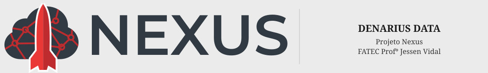

 

# 
Denarius Data

    <a href="#challenge">Challenge</a>  |  
    <a href="#solution">Solution</a>  |   
    <a href="#product-backlog">Product Backlog</a>  |  
    <a href="#dor">DoR</a>  |  
    <a href="#dod">DoD</a>  |  
    <a href="#sprint-schedule">Sprint Schedule</a>  |  
    <a href="#technologies">Technologies</a> | 
    <a href="#api-documentation">API Documentation</a> | 
    <a href="#database-modeling">Database Modeling</a> | 
    <a href="#team">Team</a> |
    <a href="#project-guidelines">Project Guidelines</a>

> Project Status: **In Development 🚧**   
> Documentation Folder: [Link](https://github.com/DenariusData/API-5SEM/tree/main/docs) 📄   

---

# 🏅 Challenge

The company **SIATT** executes strategic projects involving multiple areas of the organization, including engineering, material procurement, technical hours control, and institutional program management.

Currently, operational data is distributed across different systems and records, making integrated analysis difficult.

The challenge of this project is to **integrate, structure, and analyze strategic project data**, enabling managers to have a consolidated view of resource consumption, activity progress, and operational history of company programs.

---

# 🏅 Solution

The proposed solution consists of creating an **analytical platform for data integration and exploration**, capable of consolidating information from different areas of the company.

The system will allow:

- Integration of operational data  
- Structuring data for analysis  
- Historical visualization of project evolution  
- Support for strategic decision-making  

The goal is to transform scattered data into **structured and accessible information**, enabling more efficient management of strategic programs and projects.

→ [Back to top](#denarius-data)

---

## 📋 Functional Requirements

| ID | Functional Requirement | Description |
|----|------------------------|-------------|
| RF01 | ETL & Data Quality, DW | The system must collect and consolidate data from different sources such as spreadsheets and CSV files, standardizing project IDs and organizing the information into a unified database. |
| RF02 | Data validation and cleaning | The system must identify inconsistencies in the imported data and perform validation and correction to ensure data quality before visualization. |
| RF03 | Project cost visualization | The system must display the total cost of each project through dashboards, allowing managers to identify projects consuming more resources than expected. |
| RF04 | Delay risk indicator | The system must display projects with a risk of delay using visual indicators and dashboards to help managers make faster decisions. |
| RF05 | Cost vs execution dashboard | The system must present a comparative dashboard relating project cost and execution progress to evaluate project performance. |
| RF06 | Investment by program | The system must display the total investment grouped by program, enabling strategic analysis of resource distribution. |
| RF07 | Material consumption by project | The system must display the consumption of materials by project in graphs or tables to understand how resources are being used. |
| RF08 | Time spent by task and project | The system must display the time spent on each task and project to allow productivity and effort analysis. |
| RF09 | Analytical filters | The system must allow filtering dashboards by program, project, task, material, order, and time period to facilitate different levels of analysis. |
| RF10 | Quick search | The system must allow quick search for projects, materials, and suppliers to locate specific information easily. |
| RF11 | Data export | The system must allow exporting dashboards and reports in formats such as CSV and PDF for sharing results in meetings and presentations. |
| RF12 | Data visualization dashboards | The system must provide analytical dashboards with graphs and tables to visualize consolidated project data. |

## 📋 Non-Functional Requirements

| ID | Non-Functional Requirement | Description |
|----|----------------------------|-------------|
| RNF01 | API Documentation | The system must provide clear and detailed documentation for the API endpoints used to access consolidated data. |
| RNF02 | Responsiveness | The dashboards and visualization panels must be responsive and accessible from different devices such as desktop and mobile. |
| RNF03 | User Manual | The system must have a manual to guide users on how to use the system, including step-by-step tutorials for key features, usage tips, and common troubleshooting. |
| RNF04 | Data Quality | The system must ensure data integrity and consistency through validation and treatment during the ETL process. |
| RNF05 | Data Warehouse Modeling | The system must implement a structured data model (DW – Data Warehouse) to support analytical queries and dashboards efficiently. |
| RNF06 | Performance | The system must allow fast access to analytical dashboards and queries even when handling large datasets. |

---

## 🧵 Product Backlog

### 📋 Requirement Packages Legend

| Package | Covered Requirements |
|---------|----------------------|
| *ETL & Data Quality* | RF01, RF02 |
| *Dashboards* | RF03, RF04, RF05 |
| *Analytics* | RF06, RF07, RF08 |
| *Filters & Search* | RF09, RF10 |
| *Export* | RF11 |
| *DW* | RNF01, RNF02 |
| *Docs & UX* | RNF03, RNF04, RNF05 |

---

### ✅ Backlog Items Table

| Rank | Requirement Packages | User Story | Role | Priority | Sprint | Status | DoR (Definition of Ready) | DoD (Definition of Done) |
|------|----------------------|------------|------|----------|--------|--------|---------------------------|---------------------------|
| 1 | ETL & Data Quality, DW | As a User, I want to gather and organize data from different systems and spreadsheets so that I can view all information in a single place. | User | 1 | 1 | 🔄 In Progress | Data sources identified; data structure defined; ETL requirements documented. | Data integrated into the DW; ETL process implemented; data validated and documented. |
| 2 | Dashboards, Docs & UX | As a User, I want to visualize the total cost of each project to identify which ones are consuming more resources than expected. | User | 1 | 1 | 🔄 In Progress | Project cost data available; dashboard layout defined; metrics specified. | Dashboard showing total cost per project implemented and validated. |
| 3 | Dashboards | As a User, I want to visualize projects at risk of delay so that I can make decisions quickly. | User | 1 | 1 | 🔄 In Progress | Delay risk criteria defined; project timeline data available. | Dashboard highlights projects at risk; risk indicators validated. |
| 4 | Dashboards, Analytics | As a User, I want to visualize dashboards relating project cost and execution to evaluate project performance. | User | 2 | 1 | 🔄 In Progress | Cost and execution data available; visualization requirements defined. | Dashboard relating cost and execution implemented and tested. |
| 5 | Analytics | As a User, I want to visualize which program concentrates the highest investment to support strategic decisions. | User | 2 | 2 | ⏳ To Do | Investment data per program available; analysis requirements defined. | Visualization showing investment by program implemented and validated. |
| 6 | Analytics | As a User, I want to visualize material consumption per project to understand resource usage. | User | 2 | 2 | ⏳ To Do | Material usage data available; project relation defined. | Dashboard displaying material consumption per project implemented. |
| 7 | Analytics | As a User, I want to visualize time spent per task and project to evaluate effort and productivity. | User | 2 | 2 | ⏳ To Do | Task and time tracking data available; metrics defined. | Dashboard showing time spent per task and project implemented and validated. |
| 8 | Filters & Search | As a User, I want to filter dashboards by program, project, task, material, order, and period to perform multi-level analysis. | User | 2 | 2 | ⏳ To Do | Filter fields defined; dataset prepared for filtering. | Interactive filters implemented and functioning across dashboards. |
| 9 | Filters & Search | As a User, I want to quickly search for projects, materials, and suppliers to find information easily. | User | 3 | 2 | ⏳ To Do | Search fields defined; indexing strategy defined. | Search functionality implemented and returning correct results. |
| 10 | Export, Docs & UX | As a User, I want to export reports and dashboards to share results in meetings and presentations. | User | 3 | 3 | ⏳ To Do | Export formats defined; data available for export. | Export feature implemented and generating correct files (PDF/Excel). |

---

# 🏃‍♂️ DoR - Definition of Ready

- User stories with acceptance criteria  
- Defined subtasks  
- Defined design  
- Database modeling  
- System architecture definition  
- Sprint planning  

---

# 🏆 DoD - Definition of Done

- Code implemented  
- Tests executed  
- Documentation updated  
- API documentation completed  
- Delivery presentation videos  

→ [Back to top](#denarius-data)

---

# 📅 Sprint Schedule

| Sprint | Period | History |
|--------|--------|---------|
| Sprint 1 | 03/16 - 04/05 | [Sprint 1 Docs](https://github.com/DenariusData/API-5SEM/tree/main/docs) |
| Sprint 2 | 04/13 - 05/03 | [Sprint 2 Docs](https://github.com/DenariusData/API-5SEM/tree/main/docs) |
| Sprint 3 | 05/11 - 05/31 | [Sprint 3 Docs](https://github.com/DenariusData/API-5SEM/tree/main/docs) |

→ [Back to top](#denarius-data)

---

# 💻 Technologies

→ [Back to top](#denarius-data)

---

# 📓 API Documentation

🚧 Under construction

→ [Back to top](#denarius-data)

---

# 🖥️ Database Modeling

🚧 Under construction

→ [Back to top](#denarius-data)

---

# 👥 Team

| Role | Name | LinkedIn & GitHub |
|------|------|-------------------|
| Product Owner | Beatriz Sthefanny | [LinkedIn](https://www.linkedin.com/in/beatriz-santos-0b6773220/) · [GitHub](https://github.com/BeatrizSantos00) |
| Scrum Master | Rafael Slivka | [LinkedIn](https://www.linkedin.com/in/rafael-lopes-slivka-07753326a/) · [GitHub](https://github.com/rafaslivka) |
| Developer | Caio Osorio | [LinkedIn](https://www.linkedin.com/in/caio-o-a67224200/) · [GitHub](https://github.com/User-Business) |
| Developer | Tiago Bernardo | [LinkedIn](https://www.linkedin.com/in/tiagobernardosantos/) · [GitHub](https://github.com/TiagoBernardoSantos) |
| Developer | Victor Ryan | [LinkedIn](https://www.linkedin.com/in/victor-ryan-51738b261) · [GitHub](https://github.com/yzvictorr) |
| Developer | Ali Mohamed Khodr | [LinkedIn](https://www.linkedin.com/in/alimohamedkhodr/) · [GitHub](https://github.com/alimkhodr) |

→ [Back to top](#denarius-data)

---

# 📜 Project Guidelines

Click to expand Project Rules and Commit Standard

## 👥 Team Participation Rules

- Only **1 absence per month** is allowed in weekly meetings held on Thursday
- Respect deadlines and follow the **commit standard**
- Communicate difficulties during the process to avoid issues close to the final presentation
- Every team member is expected to present **at least one sprint**

---

## 📌 Commit Standard

Commits must follow the **"Commit Pattern – by Renato Adorno"** to ensure consistency and clarity across the repository.

### Commit Format

    <type>: <description in English>

The description must:
- Be written in **English**
- Use a **direct action tone**
- Be **clear and concise**

---

### 🧩 Commit Types

- **fix** – Fixes a bug
- **feat** – Adds a new feature
- **docs** – Documentation changes only
- **style** – Code formatting changes with no logic changes
- **refactor** – Code improvements without changing behavior
- **build** – Build system or dependency changes
- **test** – Adding or updating tests
- **chore** – Maintenance tasks

---

### ✅ Examples

    feat: add analytical filters to dashboard endpoints
    docs: translate README to English
    fix: correct date filter logic
    refactor: improve data processing performance
    test: add unit tests for filter component

---

### ⚠️ Rules

- Always write commits in **English**
- Follow the defined **types strictly**
- Avoid vague messages such as:
  - `update`
  - `fix stuff`

Prefer clear messages such as:

    fix: correct null pointer exception in service layer

→ [Back to top](#denarius-data)
